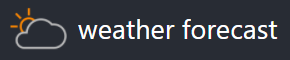
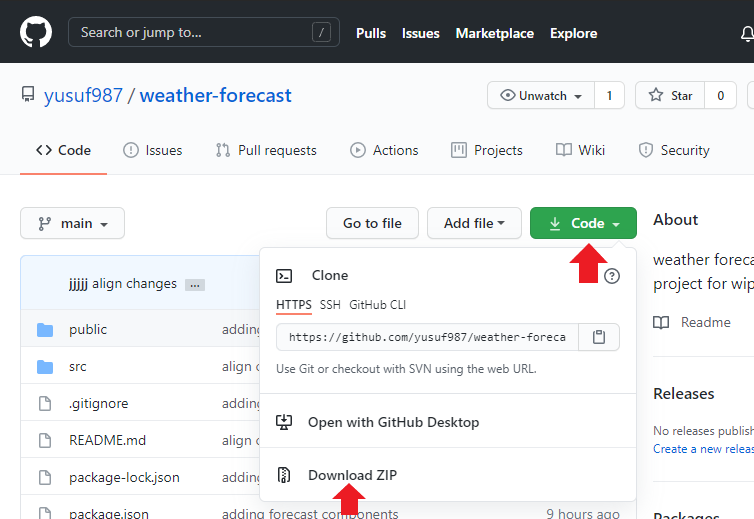

  

this app will show next 5 days weather forcast of bangalore location.

## Demo
The project is hosted on netlify  below is the live URL,  
https://weather-forecast-blr.netlify.app/

## How to build/ run/test project
### option 1 (with git)
- step 1 - clone the project by running the command ``` git clone https://github.com/yusuf987/weather-forecast.git ``` in command terminal
- step 2 - swith to project directory by ``` cd weather-forecast ```
- step 3 - install the project dependencies by ``` npm i ```
- step 4 - run ``` npm start ``` this will start the project in default browser on http://localhost:3000/

### option 2 
- step 1 - download the zip folder of the project source code as mention in below images
-  
- step 2 - extract the folder and open the project in your code editor
- step 3 - swith to root folder and run command ``` npm i ``` (rood folder the one where package.json file exists) once command succesfully project will start in defalt browser on http://localhost:3000/


## What could be done with more time

- since we calling weather API on the first load the first render may delay under the slow network connection, to give a better user experience we would show a decent spinner till the laoding time  
- i have notice small discrepancy in mozilla browser, this could be fix 
- [error handeling] - proper error handling can be done in the case of error response from weather api 
- option to change city 

## Unit Test
Jest and enzyme are used to perform unit tests on components.
Following command starts running the unit tests in the application.  

``` npm test ```

## API Reference
this project using open Weather (https://openweathermap.org/) api for 5-day weather api data

## Features

- show hour wise weather forecast in 3-hour set  
- icon indicating the sky description along with each hour set
- option to view in Celcius and Fahrenheit 
- next 5 days with week name 

## Manual Testing
**web browser:** I have tested the UI on different browsers mention below and found 98-99% identical behavior 

 - Chrome Version 87.0.4280.88 (Official Build) (64-bit)
 - Microsoft Edge Version 87.0.664.60 (Official build) (64-bit)
 - FireFox Version 84.0 (64-bit)

**mobile devices:** for small devices test I used Chrome's developer tools and test over different screen size and found 96-97% identical behavior  below are the device name & version i used 

 - Moto G4
 - Galaxy S5
 - Pixel 2
 - iphone 6/7/8
 - ipad

## Technology & Tools

this app uses a number of open source projects and tools to work properly:

- [ReactJS] - HTML enhanced for web apps!
- [node.js] - mainly used for NPM to bootstrap react project
- [VS Code] - as code editor
- [github] - to hoast the source code as public project
- [netlify] - to hoast the build project 


